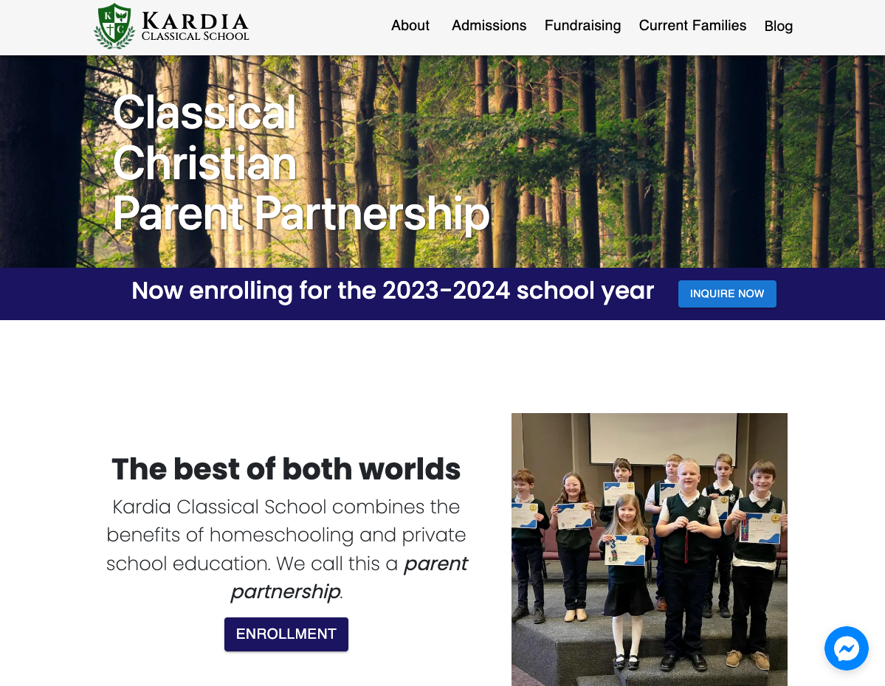

# Kardia Classical School Website

## Overview

Welcome to the README for the Kardia Classical School website! This project is built using Next.js, Material-UI, Framer Motion, and Sass. It features smooth transitions, custom fonts, parallax effects, and Facebook Messenger integration for a comprehensive and engaging user experience.

## Live Site

Explore the live site: [Kardia Classical School](https://www.kardiaclassical.org)

## Features

- **Framer Motion Transitions:** Utilized Framer Motion to implement seamless page transitions with opacity effects, providing a polished and visually appealing user interface.

- **React Parallax Banners:** Implemented React Parallax for captivating banners on main pages. The parallax effect adds depth and visual interest, creating a memorable experience for visitors.

- **Facebook Messenger Integration:** The Kardia community can now connect quickly with interested parties using the live-chat option powered by Facebook Messenger. This feature enhances communication and fosters immediate engagement.

## Tech Stack

- Next.js
- Material-UI
- Framer Motion
- Sass

## &copy; 2023 Kardia Classical School. All rights reserved.

---

Thank you for checking out the Kardia Classical School website! We hope you enjoy exploring our work.

